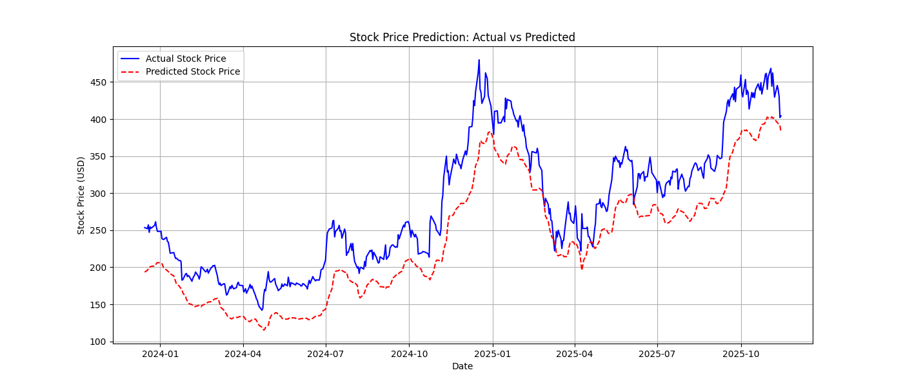

# Fintech Stock Price Predictor

An LSTM-based ML app for predicting stock prices (e.g., TSLA) with sensitivity analysis for volatility (VIX) and interest rates. Simulates Revolut's user-facing investing tools.

## Features
- Real-time data via yfinance/Alpha Vantage.
- TensorFlow LSTM for time-series forecasting.
- Interactive Streamlit UI for predictions, plots, and sensitivity.
- Builds on my EV Adoption project and Budget Tracker.

## Local Setup
1. Clone the repo.
2. Install dependencies: `pip install -r requirements.txt`.
3. Run: `streamlit run app.py`.

## Deployment
Deployable to Streamlit Cloud for live demos.

  <!-- Upload images separately and link -->

For more, see my LinkedIn: linkedin.com/in/wang-tik-chan
